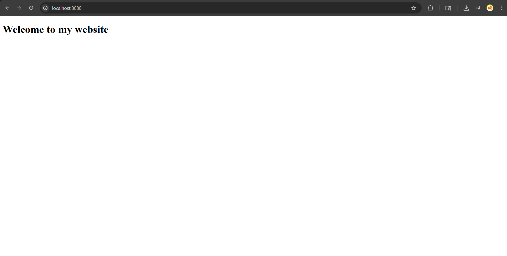

# Task 1: Nginx Web Server

This directory contains a simple, static HTML website served using an Nginx Docker container.

**Docker Hub Repository:** [nmiyani/task-app](https://hub.docker.com/repository/docker/nmiyani/task-app)

## Contents
- **`index.html`**: A basic HTML file that displays a "Welcome to my website" message.
- **`Dockerfile`**: The Docker configuration file that uses the official `nginx:latest` image, sets the correct working directory (`/usr/share/nginx/html`), and copies the `index.html` file so Nginx can serve it.

## Getting Started

### 1. Build the Docker Image
To build the Docker image and tag it for Docker Hub, navigate to this directory (`task1`) in your terminal and run:
```bash
docker build -t nmiyani/task-app:latest .
```

### 2. Run the Container
To run the container in the background and map it to your host machine's port `8080`, run:
```bash
docker run -d -p 8080:80 nmiyani/task-app:latest
```

### 3. View the Website
Once the container is running, open your web browser and navigate to:
```
http://localhost:8080
```
You should see the "Welcome to my website" page!

### Output Screenshot

