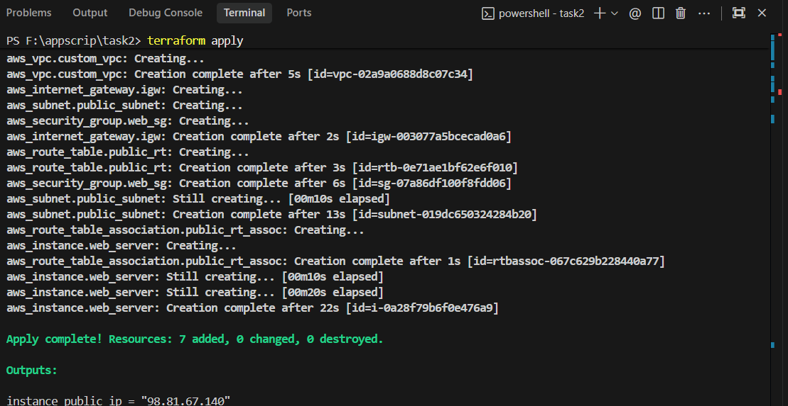
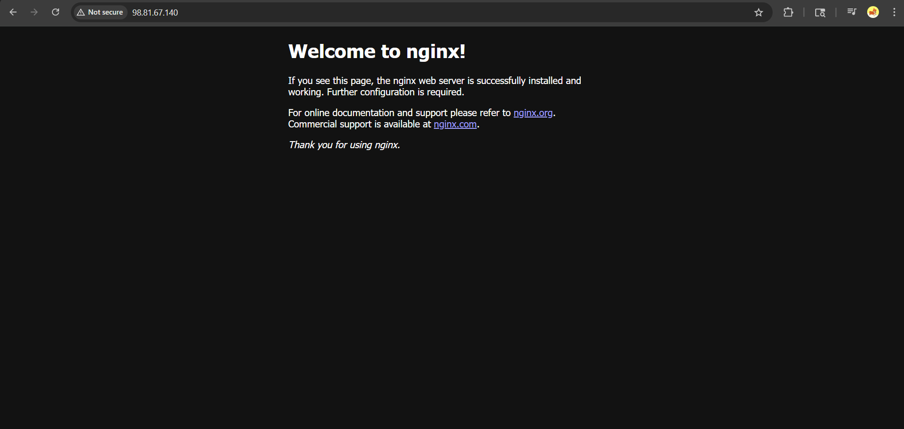

# Task 2: Infrastructure as Code with Terraform

This directory contains a Terraform configuration to provision a completely custom network and automatically deploy an Nginx web server on an AWS EC2 instance.

## Contents
- **`provider.tf`**: Configures the AWS provider and deployment region.
- **`vpc.tf`**: Defines a completely custom VPC, Public Subnet, Internet Gateway, and Route Table to ensure the infrastructure runs independently from the Default VPC.
- **`main.tf`**: Provisions the core resources, including the Security Group (allowing SSH and HTTP traffic) and the `t2.micro` EC2 instance using an Ubuntu AMI.
- **`variables.tf`**: Centralizes variable definitions like `aws_region`, `ami_id`, and `instance_type` for easy adjustments.
- **`outputs.tf`**: Defines outputs, specifically returning the public IP address of the deployed EC2 instance.
- **`install_nginx.sh`**: A bash script passed to the instance as `user_data` to automatically update packages, install Nginx, and start the web server on boot.

## Getting Started

### 1. Initialize Terraform
To initialize the working directory and download the necessary AWS provider plugins, navigate to this directory (`task2`) in your terminal and run:
```bash
terraform init
```

### 2. Preview the Infrastructure
To see a detailed plan of exactly what Terraform will create in your AWS account, run:
```bash
terraform plan
```

### 3. Deploy the Infrastructure
To provision the resources, run the apply command and type `yes` when prompted:
```bash
terraform apply
```

### 4. View the Website
Once the deployment finishes, Terraform will output the `instance_public_ip` in your console. Copy that IP address and paste it into your web browser:
```
http://<YOUR_INSTANCE_PUBLIC_IP>
```
You should see the default "Welcome to nginx!" page successfully served from your brand new AWS EC2 instance!

### Output Screenshots

**Terminal Output:**


**Browser Output:**

